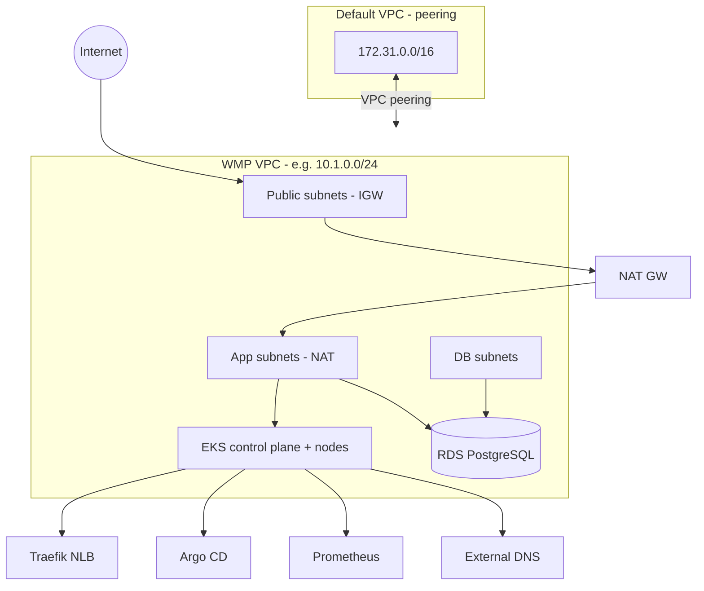

# wmp-terraform-encrypt-n-network-v9

Terraform stack for the **Wealth Management Platform (WMP)** on AWS: a dedicated VPC with peering, **encrypted** EKS worker volumes, **RDS PostgreSQL**, and cluster add-ons (Traefik, Argo CD, Prometheus, ExternalDNS) delivered via Helm.

Region: **us-east-1** (see `provider.tf`).

## What this provisions

| Module | Responsibility |
|--------|----------------|
| **`modules/network`** | VPC (`10.1.0.0/24` in dev), public / app / DB subnets across two AZs, Internet Gateway, NAT gateways, route tables, **VPC peering** to the account default VPC |
| **`modules/rds`** | PostgreSQL 16 (`db.t3.micro`), subnet group, security group, credentials from **SSM Parameter Store**, optional schema bootstrap via `setup.sql` (`local-exec`) |
| **`modules/eks`** | EKS cluster (private API only), **KMS-encrypted** node root volumes (launch template), **SPOT** managed node group (`t3.xlarge`), EKS Pod Identity for workloads, Helm releases |

Root `main.tf` wires modules together. **Network** is keyed by `var.network` (`for_each`); **RDS** and **EKS** currently consume outputs from `module.network["dev"]` (see [Caveats](#caveats)).

## Architecture (high level)



**Encryption:** worker nodes use a launch template with **EBS encryption** and `kms_key_id` from tfvars (`modules/eks/main.tf`). RDS encryption at rest is not enabled in the current module; extend `aws_db_instance` if you need it.

**Cluster access:** the EKS API is **private** (`endpoint_public_access = false`). Use a host inside the peered default VPC (or VPN) and `aws eks update-kubeconfig` (triggered by Terraform after the node group is ready).

## Repository layout

```
.
├── main.tf                 # module.network, module.databases, module.eks
├── variables.tf
├── outputs.tf
├── provider.tf
├── state.tf                # S3 backend (config per environment)
├── Makefile                # dev/prod init, apply, destroy
├── environments/
│   ├── dev/
│   │   ├── main.tfvars
│   │   └── state.tfvars
│   └── prod/
│       ├── main.tfvars
│       └── state.tfvars
└── modules/
    ├── network/            # VPC, subnets, IGW, NAT, peering
    ├── rds/                # PostgreSQL + setup.sql
    ├── eks/                # EKS, IAM, Helm (traefik, argocd, prometheus, external-dns)
    └── network-old/        # legacy layout (not used by root main.tf)
```

## Prerequisites

- **Terraform** (compatible with AWS provider in use)
- **AWS CLI** configured (`aws configure` or env vars) with rights for VPC, EKS, RDS, IAM, Route53 (for ExternalDNS), Helm-related resources
- **Helm provider** — used from `modules/eks`; apply machine must reach the cluster API after nodes are up
- **PostgreSQL client** (`psql`, path `/usr/pgsql-16/bin/psql` in RDS `local-exec`) on the machine running `terraform apply`, for schema load
- **SSM parameters** (same region/account):
  - `rds_username`
  - `rds_password`
- **S3 backend** buckets/keys as defined in `environments/*/state.tfvars` (e.g. dev: `terraform-state-mkreddy`, key `wmp-v9/dev/terraform.tfstate`)
- **KMS key** ARN in tfvars (`kms_key_id`) for encrypted node volumes

Optional: ACM certificate and DNS zone referenced in `modules/eks/traefik.yml` and Helm values (Argo CD / Prometheus hostnames).

## Configuration

### Key variables (`environments/dev/main.tfvars` example)

| Variable | Purpose |
|----------|---------|
| `env` | Environment name (EKS cluster name, tagging) |
| `kms_key_id` | KMS key for **encrypted** EKS node EBS volumes |
| `network` | Map of VPCs: `vpc_cidr`, `subnets` (`public_subnets`, `app_subnets`, `db_subnets`), `az` list |
| `default_vpc_id`, `default_vpc_rt_id`, `default_vpc_cidr` | Peering target (default VPC) |
| `databases` | RDS settings (e.g. `allocated_storage`) |
| `cluster_sg_ingress_cidr` | CIDRs allowed to reach the cluster security group on 443 |
| `vpc_id`, `subnets` | Legacy/top-level IDs (still declared in variables; network module builds new VPC in dev) |

The `apps` block in dev tfvars describes EC2/ALB-style apps from an older design; it is **not** referenced by root `main.tf` today.

### Network (dev)

- VPC: `10.1.0.0/24`
- Public: `10.1.0.0/27`, `10.1.0.32/27` — IGW
- DB: `10.1.0.64/27`, `10.1.0.96/27`
- App: `10.1.0.128/26`, `10.1.0.192/26` — NAT per AZ
- AZs: `us-east-1a`, `us-east-1b`

## Deploy

From the repo root:

```bash
# Dev
make dev-apply

# Prod (separate state backend)
make prod-apply
```

Manual equivalent:

```bash
terraform init -backend-config=environments/dev/state.tfvars
terraform apply -var-file=environments/dev/main.tfvars
```

Destroy:

```bash
make dev-destroy
# or
make prod-destroy
```

The Makefile runs `git pull`, re-inits the backend, and applies with `-auto-approve`.

## After apply

1. **Kubeconfig** (if not already updated by Terraform):

   ```bash
   aws eks update-kubeconfig --name <env> --region us-east-1
   ```

   Use `<env>` from tfvars (e.g. `dev`).

2. **Verify cluster:**

   ```bash
   kubectl get nodes
   kubectl get pods -A
   ```

3. **Helm releases** (installed by Terraform): Traefik (NLB + TLS annotations in `traefik.yml`), Argo CD, kube-prometheus-stack, ExternalDNS.

4. **Ingress hostnames** (from `modules/eks/helm.tf`, adjust for your domain):
   - Argo CD: `argocd-<env>.raghudevopsb88.online`
   - Prometheus: `prometheus-<env>.raghudevopsb88.online`

5. **RDS endpoint:** `terraform output` / AWS console → `wmp-<env>` instance; database `wmp` and schemas created by `modules/rds/setup.sql` when `local-exec` succeeds.

## EKS module details

- **Kubernetes version:** 1.35
- **Node group:** 2–3 × `t3.xlarge` **SPOT**, subnets = app subnets
- **Add-on:** `eks-pod-identity-agent`
- **Pod Identity associations:** `external-dns`, `analytics-service`, `auth-service`, `portfolio-service` (SSM read policy on the latter three)
- **Ingress:** Traefik as `LoadBalancer` with AWS NLB annotations (see `traefik.yml`)

## RDS module details

- Engine: **PostgreSQL 16.13**
- Identifier: `wmp-<env>`
- Credentials: SSM parameters `rds_username`, `rds_password`
- Post-create: `null_resource.schema_load` runs `setup.sql` (creates `wmp` DB, schemas, service users)

## Outputs

- `subnet_ids` — map of network module outputs (VPC id, subnet ids per `for_each` key)

Extend `outputs.tf` if you need RDS address or EKS endpoint exported.

## Caveats

1. **`module.network["dev"]` is hardcoded** in root `main.tf` for RDS and EKS. Prod apply still uses the **dev** network key unless you change those references to `var.env` or a dedicated key.
2. **RDS security group** allows PostgreSQL from `0.0.0.0/0` — tighten for production.
3. **Schema load** runs on the Terraform runner via `local-exec`; failed applies may require manual `psql` or taint of `null_resource.schema_load`.
4. **Private EKS endpoint** — `terraform apply` for Helm must run from a network that can reach the API (e.g. peered VPC/bastion).
5. **`network-old`** and **`apps`** in tfvars are not used by current root module.
6. **Prod `main.tfvars`** shape differs from dev (legacy `apps` / `databases` blocks); align with `variables.tf` and `main.tf` before prod apply.

## Security notes

- Do not commit real passwords; RDS bootstrap uses SSM. `setup.sql` contains example passwords suitable only for lab use.
- Rotate credentials and restrict security groups before production.
- Review Traefik ACM certificate ARN and domain ownership in `traefik.yml`.

## Related work

- Application manifests: `learn-kubernetes-eks/wmp-v1/`
- Standalone EKS experiments: `kubernetes-eks/`
- Earlier LB/RDS Terraform: `Terraform/wmp-terraform-lbs-n-rds-v8/`

## License / ownership

Internal Learn DevOps / WMP lab infrastructure. Adjust account IDs, state buckets, and domains for your AWS organization before shared use.
